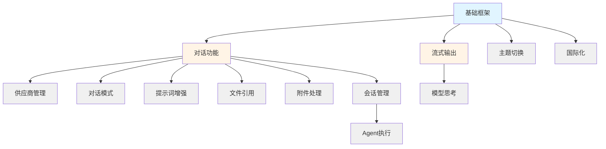

# CC Assistant 任务拆解与验收标准 (端到端详细版)

> **版本**: v2.0 (详细版)
> **创建日期**: 2026-04-13
> **文档类型**: 项目管理

---

## 目录

1. [对话功能](#1-对话功能)
2. [流式输出](#2-流式输出)
3. [供应商管理](#3-供应商管理)
4. [对话模式切换](#4-对话模式切换)
5. [模型思考](#5-模型思考)
6. [提示词增强](#6-提示词增强)
7. [主题切换](#7-主题切换)
8. [国际化](#8-国际化)
9. [文件引用](#9-文件引用)
10. [附件处理](#10-附件处理)
11. [会话管理](#11-会话管理)
12. [Agent执行](#12-agent执行)

---

## 1. 对话功能

### 1.1 功能概述

用户在输入框输入消息，系统验证后发送给 AI，AI 以流式方式返回响应，前端实时渲染。

### 1.2 前端任务

#### FE-CHAT-001: 输入区域组件

**职责**: 接收用户输入，提供输入验证和增强功能

**子任务**:
- [ ] 创建多行文本输入框
- [ ] 实现字符计数显示
- [ ] 实现输入验证（空内容、长度限制）
- [ ] 实现发送按钮状态管理
- [ ] 实现快捷键支持（Enter发送，Shift+Enter换行）
- [ ] 实现占位符显示
- [ ] 实现 @file 触发检测
- [ ] 实现 / 指令触发检测
- [ ] 实现粘贴图片检测

**验收标准**:
- ✅ 输入框样式符合设计规范
- ✅ 发送按钮在空内容时禁用
- ✅ 超过长度限制时显示警告
- ✅ Enter 发送消息，Shift+Enter 换行
- ✅ 输入 @ 时触发文件引用弹窗
- ✅ 输入 / 时触发指令弹窗
- ✅ 粘贴图片时显示预览

**接口依赖**:
```kotlin
interface InputAreaDelegate {
    fun onSendMessage(content: String, fileRefs: List<FileReference>, attachments: List<Attachment>)
    fun onFileReferenceTrigger()
    fun onCommandTrigger()
}
```

---

#### FE-CHAT-002: 消息渲染组件

**职责**: 渲染用户消息和 AI 消息，支持流式追加

**子任务**:
- [ ] 创建消息容器组件
- [ ] 实现用户消息卡片（右侧对齐）
- [ ] 实现 AI 消息卡片（左侧对齐）
- [ ] 实现消息内容渲染（纯文本）
- [ ] 实现流式文本追加
- [ ] 实现自动滚动到底部
- [ ] 实现消息时间戳显示
- [ ] 实现消息操作按钮（复制、重新生成）

**验收标准**:
- ✅ 用户消息蓝色气泡，右侧对齐
- ✅ AI 消息深色卡片，左侧对齐
- ✅ 流式文本实时追加，无闪烁
- ✅ 新消息到达时自动滚动
- ✅ 用户滚动时暂停自动滚动
- ✅ 时间戳格式正确（HH:mm）
- ✅ 操作按钮功能正常

**接口依赖**:
```kotlin
interface MessageRenderer {
    fun appendUserMessage(message: Message)
    fun appendAIMessage(messageId: String)
    fun appendText(messageId: String, text: String)
    fun finalizeMessage(messageId: String)
    fun scrollToBottom()
}
```

---

#### FE-CHAT-003: 状态指示器

**职责**: 显示当前对话状态（空闲、思考中、流式输出中、错误）

**子任务**:
- [ ] 创建状态指示组件
- [ ] 实现空闲状态显示
- [ ] 实现思考状态动画
- [ ] 实现流式输出状态动画
- [ ] 实现错误状态显示
- [ ] 实现状态切换动画

**验收标准**:
- ✅ 空闲状态: "就绪" 灰色指示
- ✅ 思考状态: "正在思考..." 动画光标
- ✅ 流式状态: "正在回复..." 动画光标
- ✅ 错误状态: "错误" 红色指示
- ✅ 状态切换平滑

---

### 1.3 后端任务

#### BE-CHAT-001: 聊天服务核心

**职责**: 协调对话流程，处理消息发送和接收

**子任务**:
- [ ] 实现 ChatService 接口
- [ ] 实现输入验证逻辑
- [ ] 实现消息ID生成
- [ ] 实现用户消息存储
- [ ] 实现上下文构建调用
- [ ] 实现Daemon通信调用
- [ ] 实现流式回调处理
- [ ] 实现错误处理和重试
- [ ] 实现消息完成处理

**验收标准**:
- ✅ 输入验证正确拦截无效输入
- [ ] 消息ID唯一且符合UUID格式
- ✅ 用户消息正确存储到会话
- ✅ 上下文包含正确的文件引用
- ✅ Daemon通信格式正确
- ✅ 流式回调正确触发
- ✅ 错误时返回友好提示

**代码结构**:
```kotlin
@Service(Service.Level.PROJECT)
class ChatServiceImpl : ChatService {
    // sendMessage()
    // registerStreamListener()
    // cancelCurrentMessage()
    // validateRequest()
    // handleStreamCallback()
}
```

---

#### BE-CHAT-002: 消息持久化

**职责**: 管理消息的存储和检索

**子任务**:
- [ ] 定义消息数据结构
- [ ] 实现消息序列化
- [ ] 实现消息反序列化
- [ ] 实现消息存储到会话
- [ ] 实现消息更新
- [ ] 实现消息删除
- [ ] 实现消息查询

**验收标准**:
- ✅ 消息可正确序列化到JSON
- ✅ 消息可正确从JSON反序列化
- ✅ 消息存储后不丢失
- ✅ 消息更新正确保存
- ✅ 消息查询结果正确

---

#### BE-CHAT-003: 流式事件分发

**职责**: 接收 Daemon 的流式事件并分发给监听器

**子任务**:
- [ ] 定义流式事件类型
- [ ] 实现监听器注册
- [ ] 实现 chunk 事件分发
- [ ] 实现 thinking 事件分发
- [ ] 实现 tool_use 事件分发
- [ ] 实现 complete 事件分发
- [ ] 实现 error 事件分发
- [ ] 实现线程安全（EDT切换）

**验收标准**:
- ✅ 所有事件类型正确分发
- ✅ 监听器在EDT线程接收事件
- ✅ 多监听器时所有都收到事件
- ✅ 监听器注销后不再接收事件

---

## 2. 流式输出

### 2.1 功能概述

AI 响应以流式方式逐字返回，前端实时渲染到消息卡片，提供打字机效果。

### 2.2 前端任务

#### FE-STREAM-001: 流式消息卡片

**职责**: 显示流式输出的 AI 消息

**子任务**:
- [ ] 创建流式消息卡片组件
- [ ] 实现文本内容追加
- [ ] 实现HTML渲染（支持Markdown）
- [ ] 实现节流更新（~60fps）
- [ ] 实现光标闪烁效果
- [ ] 实现自动滚动
- [ ] 实现流式完成后添加操作按钮

**验收标准**:
- ✅ 文本实时追加无延迟
- ✅ Markdown正确渲染（代码块、列表、链接）
- ✅ 更新频率不超过60fps，避免卡顿
- ✅ 光标闪烁自然
- ✅ 流式完成后显示操作按钮
- ✅ 长消息性能良好（>10000字符）

**性能要求**:
- 追加文本操作 < 10ms
- 渲染更新操作 < 16ms
- 内存占用增长线性

---

#### FE-STREAM-002: 流式状态动画

**职责**: 显示流式输出的视觉反馈

**子任务**:
- [ ] 创建流式状态指示器
- [ ] 实现思考动画（3个点循环）
- [ ] 实现流式动画（光标闪烁）
- [ ] 实现状态切换过渡
- [ ] 实现动画停止逻辑

**验收标准**:
- ✅ 思考动画: "..." 循环
- ✅ 流式动画: "▌" 闪烁
- ✅ 动画切换平滑
- ✅ 完成后动画立即停止

---

### 2.3 后端任务

#### BE-STREAM-001: NDJSON 流式解析

**职责**: 解析 Daemon 输出的 NDJSON 流

**子任务**:
- [ ] 实现 NDJSON 行读取
- [ ] 实现多行 JSON 重组
- [ ] 实现 chunk 类型解析
- [ ] 实现 thinking 类型解析
- [ ] 实现 tool_use 类型解析
- [ ] 实现 complete 类型解析
- [ ] 实现 error 类型解析
- [ ] 实现解析错误处理

**验收标准**:
- ✅ 单行 JSON 正确解析
- ✅ 多行 JSON 正确重组
- ✅ 所有消息类型正确识别
- ✅ 解析错误不影响后续解析
- ✅ 解析性能满足要求（<1ms/行）

---

#### BE-STREAM-002: 流式缓冲管理

**职责**: 管理流式数据的缓冲和分发

**子任务**:
- [ ] 实现流式上下文管理
- [ ] 实现文本缓冲
- [ ] 实现缓冲刷新策略
- [ ] 实现缓冲大小限制
- [ ] 实现缓冲清理

**验收标准**:
- ✅ 流式上下文正确创建和销毁
- ✅ 文本缓冲正确追加
- ✅ 缓冲按策略刷新（定时/大小）
- ✅ 缓冲超限时正确处理
- ✅ 流式完成后缓冲正确清理

---

## 3. 供应商管理

### 3.1 功能概述

管理多个 AI Provider，支持添加、删除、切换，每个 Provider 有独立的 API Key 和配置。

### 3.2 前端任务

#### FE-PROVIDER-001: Provider 选择器

**职责**: 显示当前 Provider，支持切换

**子任务**:
- [ ] 创建 Provider 选择器组件
- [ ] 实现 Provider 图标显示
- [ ] 实现 Provider 名称显示
- [ ] 实现下拉菜单
- [ ] 实现 Provider 列表渲染
- [ ] 实现切换确认对话框
- [ ] 实现切换动画

**验收标准**:
- ✅ 当前 Provider 正确显示
- ✅ Provider 图标正确（Claude🟠、OpenRouter🔵）
- ✅ 下拉菜单显示所有可用 Provider
- ✅ 切换后立即生效
- ✅ 切换有动画过渡

---

#### FE-PROVIDER-002: 模型选择器

**职责**: 显示当前模型，支持切换

**子任务**:
- [ ] 创建模型选择器组件
- [ ] 实现模型名称显示
- [ ] 实现模型详情 tooltip（价格、上下文）
- [ ] 实现下拉菜单
- [ ] 实现模型列表渲染
- [ ] 实现模型切换
- [ ] 实现切换后状态更新

**验收标准**:
- ✅ 当前模型正确显示
- ✅ Tooltip 显示完整信息
- ✅ 下拉菜单显示当前 Provider 的所有模型
- ✅ 切换后默认模型更新

---

#### FE-PROVIDER-003: Provider 设置对话框

**职责**: 管理所有 Provider 配置

**子任务**:
- [ ] 创建设置对话框
- [ ] 实现 Provider 列表
- [ ] 实现添加 Provider 表单
- [ ] 实现编辑 Provider 表单
- [ ] 实现 API Key 输入（密码模式）
- [ ] 实现 API Key 验证按钮
- [ ] 实现 Provider 删除确认
- [ ] 实现内置 Provider 禁止删除

**验收标准**:
- ✅ 所有 Provider 正确显示
- ✅ 表单验证正确
- ✅ API Key 验证功能正常
- ✅ 内置 Provider 不能删除
- ✅ 删除有确认对话框
- ✅ 保存后实时生效

---

### 3.3 后端任务

#### BE-PROVIDER-001: Provider 配置管理

**职责**: 管理 Provider 配置的增删改查

**子任务**:
- [ ] 定义 Provider 配置数据结构
- [ ] 实现配置持久化
- [ ] 实现添加 Provider
- [ ] 实现更新 Provider
- [ ] 实现删除 Provider
- [ ] 实现获取活跃 Provider
- [ ] 实现切换活跃 Provider
- [ ] 实现配置验证

**验收标准**:
- ✅ 配置正确保存到磁盘
- ✅ 重启后配置正确恢复
- ✅ 添加时验证ID唯一
- ✅ 删除时验证非内置
- ✅ 切换后通知 Daemon
- ✅ 内置 Provider 正确初始化

---

#### BE-PROVIDER-002: API Key 验证

**职责**: 验证 API Key 是否有效

**子任务**:
- [ ] 实现 Claude API Key 验证
- [ ] 实现 OpenRouter API Key 验证
- [ ] 实现自定义 Provider 验证
- [ ] 实现验证结果缓存
- [ ] 实现异步验证
- [ ] 实现超时处理

**验收标准**:
- ✅ Claude Key 正确验证
- ✅ OpenRouter Key 正确验证
- ✅ 验证结果正确显示
- ✅ 验证超时正确处理（30s）
- ✅ 验证失败显示错误信息

---

#### BE-PROVIDER-003: Provider 切换通知

**职责**: 切换 Provider 时通知 Daemon

**子任务**:
- [ ] 实现 Daemon 通知命令
- [ ] 实现 NDJSON 格式化
- [ ] 实现通知确认等待
- [ ] 实现通知失败处理
- [ ] 实现切换事件发布

**验收标准**:
- ✅ 切换命令格式正确
- ✅ Daemon 正确接收并切换
- ✅ 切换失败时正确处理
- ✅ 事件正确发布到监听器

---

## 4. 对话模式切换

### 4.1 功能概述

支持 Auto、Thinking、Plan 三种对话模式，不同模式影响 AI 行为。

### 4.2 前端任务

#### FE-MODE-001: 模式选择器

**职责**: 显示当前模式，支持切换

**子任务**:
- [ ] 创建模式选择器组件
- [ ] 实现模式图标显示（🤖/💭/📋）
- [ ] 实现模式名称显示
- [ ] 实现下拉菜单
- [ ] 实现模式描述 tooltip
- [ ] 实现模式切换动画
- [ ] 实现模式颜色主题

**验收标准**:
- ✅ 当前模式正确显示
- ✅ 模式图标正确
- ✅ Tooltip 显示模式描述
- ✅ 切换后立即生效
- ✅ 模式颜色正确应用

---

#### FE-MODE-002: 模式说明面板

**职责**: 显示各模式的详细说明

**子任务**:
- [ ] 创建模式说明对话框
- [ ] 实现 Auto 模式说明
- [ ] 实现 Thinking 模式说明
- [ ] 实现 Plan 模式说明
- [ ] 实现参数对比表格
- [ ] 实现推荐场景说明

**验收标准**:
- ✅ 所有模式说明完整
- ✅ 参数对比清晰
- ✅ 推荐场景明确
- ✅ UI 美观易读

---

### 4.3 后端任务

#### BE-MODE-001: 模式配置管理

**职责**: 管理对话模式的配置

**子任务**:
- [ ] 定义模式枚举
- [ ] 定义模式配置数据结构
- [ ] 实现默认配置
- [ ] 实现配置获取
- [ ] 实现配置存储
- [ ] 实现配置加载

**验收标准**:
- ✅ 三种模式正确配置
- ✅ 默认配置合理
- ✅ 配置正确持久化
- ✅ 重启后配置正确恢复

---

#### BE-MODE-002: 模式参数转换

**职责**: 将模式配置转换为请求参数

**子任务**:
- [ ] 实现 Auto 模式参数转换
- [ ] 实现 Thinking 模式参数转换
- [ ] 实现 Plan 模式参数转换
- [ ] 实现自定义模式支持
- [ ] 实现参数验证

**验收标准**:
- ✅ Auto 模式参数正确
- ✅ Thinking 模式启用 thinking
- ✅ Plan 模式降低 temperature
- ✅ 自定义模式参数正确应用

---

## 5. 模型思考

### 5.1 功能概述

AI 思考时显示思考过程，支持折叠/展开，实时更新。

### 5.2 前端任务

#### FE-THINKING-001: 思考卡片组件

**职责**: 显示 AI 思考内容

**子任务**:
- [ ] 创建思考卡片组件
- [ ] 实现折叠/展开功能
- [ ] 实现思考内容显示
- [ ] 实现思考状态指示
- [ ] 实现实时内容追加
- [ ] 实现完成标记
- [ ] 实现样式主题

**验收标准**:
- ✅ 默认折叠状态
- [ ] 点击展开/折叠平滑
- ✅ 思考内容正确显示
- ✅ 进行中显示光标动画
- ✅ 完成后显示完成标记
- ✅ 样式符合设计规范

---

#### FE-THINKING-002: 思考内容渲染

**职责**: 渲染思考内容，支持格式化

**子任务**:
- [ ] 实现纯文本渲染
- [ ] 实现列表格式化
- [ ] 实现代码块渲染
- [ ] 实现关键词高亮
- [ ] 实现滚动支持

**验收标准**:
- ✅ 文本正确显示
- ✅ 列表正确格式化
- ✅ 代码块正确高亮
- ✅ 关键词正确高亮
- ✅ 支持滚动查看长内容

---

### 5.3 后端任务

#### BE-THINKING-001: 思考事件处理

**职责**: 接收并处理 Daemon 的 thinking 事件

**子任务**:
- [ ] 实现 thinking 事件监听
- [ ] 实现思考内容提取
- [ ] 实现思考内容分发
- [ ] 实现思考完成检测
- [ ] 实现思考内容存储

**验收标准**:
- ✅ thinking 事件正确接收
- ✅ 思考内容正确提取
- ✅ 事件正确分发给监听器
- ✅ 完成标记正确设置
- ✅ 思考内容正确存储到消息

---

#### BE-THINKING-002: 思考内容组装

**职责**: 组装完整的思考内容

**子任务**:
- [ ] 实现思考片段缓存
- [ ] 实现片段追加
- [ ] 实现片段清理
- [ ] 实现完整内容获取

**验收标准**:
- ✅ 片段正确追加
- ✅ 片段顺序正确
- ✅ 完成后正确组装
- ✅ 内容完整无丢失

---

## 6. 提示词增强

### 6.1 功能概述

自动增强用户输入的提示词，添加上下文、优化格式等。

### 6.2 前端任务

#### FE-ENHANCE-001: 增强面板

**职责**: 显示提示词增强界面

**子任务**:
- [ ] 创建增强面板组件
- [ ] 实现原始输入显示
- [ ] 实现增强后显示
- [ ] 实现增强按钮
- [ ] 实现接受/拒绝按钮
- [ ] 实现变更说明显示
- [ ] 实现置信度显示
- [ ] 实现卡片切换动画

**验收标准**:
- ✅ 原始和增强对比清晰
- ✅ 增强按钮状态正确
- ✅ 变更说明简洁明了
- ✅ 置信度正确显示
- ✅ 卡片切换平滑

---

#### FE-ENHANCE-002: 增强设置

**职责**: 配置提示词增强规则

**子任务**:
- [ ] 创建增强设置对话框
- [ ] 实现规则列表
- [ ] 实现规则启用/禁用
- [ ] 实现规则优先级调整
- [ ] 实现自动增强开关
- [ ] 实现增强预览

**验收标准**:
- ✅ 所有规则正确显示
- ✅ 启用状态正确保存
- ✅ 优先级调整生效
- ✅ 自动增强开关正常
- ✅ 预览功能正常

---

### 6.3 后端任务

#### BE-ENHANCE-001: 增强规则引擎

**职责**: 实现提示词增强规则

**子任务**:
- [ ] 实现规则接口定义
- [ ] 实现文件上下文规则
- [ ] 实现选中文本规则
- [ ] 实现代码优化格式规则
- [ ] 实现语言标识规则
- [ ] 实现结构化规则
- [ ] 实现规则链执行
- [ ] 实现规则优先级

**验收标准**:
- ✅ 文件上下文正确添加
- ✅ 选中文本正确添加
- ✅ 代码优化格式正确应用
- ✅ 语言标识正确添加
- ✅ 复杂请求正确结构化
- ✅ 规则按优先级执行

---

#### BE-ENHANCE-002: 上下文构建

**职责**: 为提示词增强构建上下文

**子任务**:
- [ ] 实现文件引用上下文
- [ ] 实现项目信息上下文
- [ ] 实现编辑器上下文
- [ ] 实现选中文本上下文
- [ ] 实现会话历史上下文

**验收标准**:
- ✅ 文件引用信息完整
- ✅ 项目信息准确
- ✅ 编辑器上下文正确
- ✅ 选中文本完整包含
- ✅ 历史上下文合理摘要

---

## 7. 主题切换

### 7.1 功能概述

支持深色/浅色主题，跟随 IDE 主题，支持自定义。

### 7.2 前端任务

#### FE-THEME-001: 主题应用

**职责**: 应用主题到所有组件

**子任务**:
- [ ] 实现主题颜色常量
- [ ] 实现主题管理器
- [ ] 实现主题监听
- [ ] 实现主题应用函数
- [ ] 实现组件主题更新

**验收标准**:
- ✅ 所有颜色使用主题常量
- ✅ 主题切换后所有组件更新
- ✅ 主题切换无闪烁
- ✅ 自定义主题正确应用

---

#### FE-THEME-002: 主题设置

**职责**: 主题配置界面

**子任务**:
- [ ] 创建主题设置页面
- [ ] 实现主题选择
- [ ] 实现自定义颜色配置
- [ ] 实现主题预览
- [ ] 实现主题导入/导出

**验收标准**:
- ✅ 主题选择功能正常
- ✅ 自定义颜色正确保存
- ✅ 预览实时更新
- ✅ 导入/导出功能正常

---

### 7.3 后端任务

#### BE-THEME-001: 主题管理

**职责**: 管理主题配置和颜色

**子任务**:
- [ ] 定义主题数据结构
- [ ] 实现主题配置存储
- [ ] 实现IDE主题检测
- [ ] 实现主题颜色获取
- [ ] 实现主题事件发布

**验收标准**:
- ✅ 主题配置正确保存
- ✅ IDE主题正确检测
- ✅ 颜色获取正确
- ✅ 事件正确发布

---

## 8. 国际化

### 8.1 功能概述

支持中英文双语，自动跟随 IDE 语言。

### 8.2 前端任务

#### FE-I18N-001: 国际化组件

**职责**: 支持国际化的UI组件

**子任务**:
- [ ] 创建 I18nButton
- [ ] 创建 I18nLabel
- [ ] 创建 I18nCheckBox
- [ ] 实现语言监听
- [ ] 实现自动更新

**验收标准**:
- ✅ 组件文本自动更新
- ✅ 语言切换后无残留
- ✅ 组件功能不受影响

---

#### FE-I18N-002: 语言设置

**职责**: 语言配置界面

**子任务**:
- [ ] 创建语言设置页面
- [ ] 实现语言列表
- [ ] 实现语言切换
- [ ] 实现预览功能

**验收标准**:
- ✅ 所有语言正确显示
- ✅ 切换后立即生效
- ✅ 预览功能正常

---

### 8.3 后端任务

#### BE-I18N-001: 国际化服务

**职责**: 提供翻译API

**子任务**:
- [ ] 实现资源加载
- [ ] 实现语言检测
- [ ] 实现翻译获取
- [ ] 实现参数替换
- [ ] 实现缺失翻译处理

**验收标准**:
- ✅ 资源正确加载
- ✅ 语言检测准确
- ✅ 翻译正确返回
- ✅ 参数正确替换
- ✅ 缺失时返回键名

---

#### BE-I18N-002: 资源文件

**职责**: 翻译资源

**子任务**:
- [ ] 创建英文资源文件
- [ ] 创建中文资源文件
- [ ] 翻译所有UI文本
- [ ] 翻译所有指令
- [ ] 翻译所有错误消息

**验收标准**:
- ✅ 所有文本有翻译
- ✅ 翻译准确自然
- ✅ 无遗漏文本

---

## 9. 文件引用

### 9.1 功能概述

用户输入 @ 触发文件选择，支持文件搜索和行范围。

### 9.2 前端任务

#### FE-FILEREF-001: 文件引用弹窗

**职责**: 显示文件选择弹窗

**子任务**:
- [ ] 创建文件引用弹窗
- [ ] 实现文件搜索框
- [ ] 实现文件列表
- [ ] 实现文件图标
- [ ] 实现文件路径显示
- [ ] 实现文件选择
- [ ] 实现行范围输入
- [ ] 实现弹窗定位

**验收标准**:
- ✅ 弹窗在输入框上方显示
- ✅ 搜索功能正常
- ✅ 文件列表正确显示
- ✅ 选择后正确插入到输入框
- ✅ 支持键盘导航

---

#### FE-FILEREF-002: 引用标签显示

**职责**: 在输入框显示已引用的文件

**子任务**:
- [ ] 创建引用标签组件
- [ ] 实现标签样式
- [ ] 实现删除功能
- [ ] 实现标签点击定位

**验收标准**:
- ✅ 标签样式符合规范
- ✅ 删除功能正常
- ✅ 点击定位到文件

---

### 9.3 后端任务

#### BE-FILEREF-001: 文件搜索

**职责**: 搜索项目文件

**子任务**:
- [ ] 实现文件索引
- [ ] 实现文件搜索
- [ ] 实现模糊匹配
- [ ] 实现结果排序
- [ ] 实现性能优化

**验收标准**:
- ✅ 搜索结果准确
- ✅ 模糊匹配正确
- ✅ 搜索速度快（<100ms）
- ✅ 结果排序合理

---

#### BE-FILEREF-002: 文件内容读取

**职责**: 读取引用文件的内容

**子任务**:
- [ ] 实现文件读取
- [ ] 实现行范围提取
- [ ] 实现语言检测
- [ ] 实现内容缓存
- [ ] 实现错误处理

**验收标准**:
- ✅ 文件内容正确读取
- ✅ 行范围正确提取
- ✅ 语言检测准确
- ✅ 缓存提高性能
- ✅ 错误时友好提示

---

## 10. 附件处理

### 10.1 功能概述

支持图片和文件附件，拖拽或粘贴上传。

### 10.2 前端任务

#### FE-ATTACH-001: 附件预览

**职责**: 显示附件预览

**子任务**:
- [ ] 创建附件预览组件
- [ ] 实现图片预览
- [ ] 实现文件预览
- [ ] 实现预览删除
- [ ] 实现预览大小限制

**验收标准**:
- ✅ 图片正确显示
- ✅ 文件图标正确
- ✅ 删除功能正常
- ✅ 预览大小符合规范

---

#### FE-ATTACH-002: 拖拽上传

**职责**: 支持拖拽文件到输入框

**子任务**:
- [ ] 实现拖拽监听
- [ ] 实现拖拽高亮
- [ ] 实现文件处理
- [ ] 实现错误提示

**验收标准**:
- ✅ 拖拽高亮正确显示
- ✅ 文件正确处理
- ✅ 不支持类型有提示

---

### 10.3 后端任务

#### BE-ATTACH-001: 附件处理

**职责**: 处理附件数据

**子任务**:
- [ ] 实现图片 Base64 编码
- [ ] 实现文件大小验证
- [ ] 实现文件类型验证
- [ ] 实现附件存储
- [ ] 实现内存管理

**验收标准**:
- ✅ 图片正确编码
- ✅ 大小限制正确
- ✅ 类型验证正确
- ✅ 内存占用合理

---

## 11. 会话管理

### 11.1 功能概述

管理多个对话会话，支持创建、切换、删除、搜索。

### 11.2 前端任务

#### FE-SESSION-001: 会话列表

**职责**: 显示所有会话

**子任务**:
- [ ] 创建会话列表组件
- [ ] 实现会话项显示
- [ ] 实现搜索功能
- [ ] 实现收藏标记
- [ ] 实现右键菜单
- [ ] 实现拖拽排序

**验收标准**:
- ✅ 会话列表正确显示
- ✅ 搜索功能正常
- ✅ 收藏标记正确
- ✅ 右键菜单完整

---

#### FE-SESSION-002: 会话切换

**职责**: 切换当前会话

**子任务**:
- [ ] 实现会话切换逻辑
- [ ] 实现消息区域更新
- [ ] 实现状态栏更新
- [ ] 实现切换动画

**验收标准**:
- ✅ 切换后消息正确显示
- ✅ 状态栏正确更新
- ✅ 切换动画流畅

---

### 11.3 后端任务

#### BE-SESSION-001: 会话存储

**职责**: 管理会话数据

**子任务**:
- [ ] 实现会话创建
- [ ] 实现会话存储
- [ ] 实现会话加载
- [ ] 实现会话删除
- [ ] 实现会话搜索
- [ ] 实现会话持久化

**验收标准**:
- ✅ 会话正确创建
- ✅ 会话正确保存
- ✅ 会话正确加载
- ✅ 搜索结果准确

---

#### BE-SESSION-002: 会话回溯

**职责**: 支持回滚到历史状态

**子任务**:
- [ ] 实现回溯点创建
- [ ] 实现回溯点存储
- [ ] 实现回滚逻辑
- [ ] 实现回溯点UI

**验收标准**:
- ✅ 回溯点正确创建
- ✅ 回滚功能正常
- ✅ 回滚后状态正确

---

## 12. Agent 执行

### 12.1 功能概述

执行 Agent 任务，显示任务进度和子 Agent 状态。

### 12.2 前端任务

#### FE-AGENT-001: Agent 状态面板

**职责**: 显示 Agent 执行状态

**子任务**:
- [ ] 创建状态面板组件
- [ ] 实现任务列表显示
- [ ] 实现进度条
- [ ] 实现子 Agent 追踪
- [ ] 实现控制按钮

**验收标准**:
- ✅ 任务列表正确显示
- ✅ 进度条准确
- ✅ 子 Agent 状态可见
- ✅ 控制按钮功能正常

---

### 12.3 后端任务

#### BE-AGENT-001: Agent 执行引擎

**职责**: 执行 Agent 任务

**子任务**:
- [ ] 实现 Agent 配置加载
- [ ] 实现任务执行
- [ ] 实现进度回调
- [ ] 实现子 Agent 管理
- [ ] 实现错误处理

**验收标准**:
- ✅ Agent 正确执行
- ✅ 进度回调正确
- ✅ 子 Agent 正确追踪
- ✅ 错误正确处理

---

## 13. 任务依赖关系



---

## 14. 验收标准总结

### 14.1 功能完整性

| 功能 | 前端任务 | 后端任务 | 验收标准 |
|------|---------|---------|---------|
| 对话 | FE-CHAT-001~003 | BE-CHAT-001~003 | 消息可发送接收 |
| 流式输出 | FE-STREAM-001~002 | BE-STREAM-001~002 | 流式显示流畅 |
| 供应商 | FE-PROVIDER-001~003 | BE-PROVIDER-001~003 | 可切换Provider |
| 模式 | FE-MODE-001~002 | BE-MODE-001~002 | 模式切换生效 |
| 思考 | FE-THINKING-001~002 | BE-THINKING-001~002 | 思考内容显示 |
| 增强 | FE-ENHANCE-001~002 | BE-ENHANCE-001~002 | 提示词可增强 |
| 主题 | FE-THEME-001~002 | BE-THEME-001 | 主题可切换 |
| 国际化 | FE-I18N-001~002 | BE-I18N-001~002 | 语言可切换 |
| 文件引用 | FE-FILEREF-001~002 | BE-FILEREF-001~002 | @file 可用 |
| 附件 | FE-ATTACH-001~002 | BE-ATTACH-001 | 可发送附件 |
| 会话 | FE-SESSION-001~002 | BE-SESSION-001~002 | 会话可管理 |
| Agent | FE-AGENT-001 | BE-AGENT-001 | Agent 可执行 |

### 14.2 质量标准

| 类型 | 标准 |
|------|------|
| 编译 | ✅ 无错误 |
| 测试 | > 70% 覆盖率 |
| 性能 | 响应 < 300ms |
| 内存 | < 300MB |
| UI | 符合设计规范 |

---

*文档版本: v2.0 | 最后更新: 2026-04-13*
