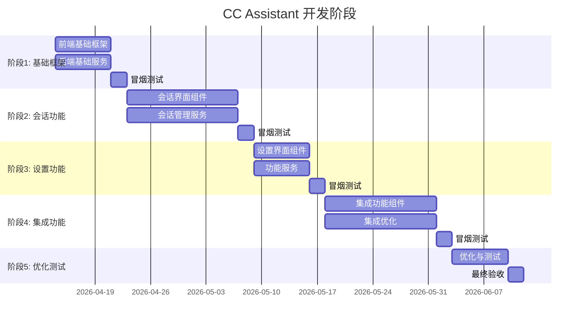

# CC Assistant 阶段划分与测试验证

> **版本**: v1.0
> **创建日期**: 2026-04-13
> **文档类型**: 项目管理

---

## 1. 阶段划分总览



---

## 2. 阶段 1: 基础框架 (Week 1-2)

### 2.1 目标

搭建项目骨架，实现基础 UI 框架和 Daemon 通信

### 2.2 任务列表

#### 前端任务 (FE-001 ~ FE-006)

| 任务ID | 任务名称 | 预估工时 | 依赖 | 优先级 |
|--------|---------|---------|------|--------|
| FE-001 | 项目初始化 | 4h | - | P0 |
| FE-002 | 插件配置 | 4h | FE-001 | P0 |
| FE-003 | 主题系统 | 8h | FE-001 | P0 |
| FE-004 | 基础组件库 | 16h | FE-003 | P0 |
| FE-005 | ToolWindow框架 | 8h | FE-002 | P0 |
| FE-006 | 国际化框架 | 8h | FE-001 | P1 |

#### 后端任务 (BE-001 ~ BE-006)

| 任务ID | 任务名称 | 预估工时 | 依赖 | 优先级 |
|--------|---------|---------|------|--------|
| BE-001 | ConfigService | 8h | - | P0 |
| BE-002 | DaemonBridgeService基础 | 16h | BE-001 | P0 |
| BE-003 | daemon.js开发 | 24h | - | P0 |
| BE-004 | NDJSONParser | 12h | BE-002 | P0 |
| BE-005 | I18nService | 6h | BE-001 | P1 |
| BE-006 | DependencyManager | 8h | BE-001 | P1 |

### 2.3 冒烟测试 (Smoke Test)

**测试时间**: 阶段结束前 2 天

**测试场景**:

```
┌─────────────────────────────────────────────────────────────┐
│  阶段 1 冒烟测试场景                                         │
├─────────────────────────────────────────────────────────────┤
│                                                             │
│  场景 1: 插件加载                                            │
│  1. 在 IDEA 中加载插件                                      │
│  2. 验证插件信息正确显示                                    │
│  3. 验证 ToolWindow 可打开                                  │
│                                                             │
│  场景 2: Daemon 启动                                        │
│  1. 启动 Daemon 进程                                        │
│  2. 验证进程状态正常                                        │
│  3. 验证心跳检测正常                                        │
│                                                             │
│  场景 3: 基础 UI 渲染                                       │
│  1. 打开 ToolWindow                                         │
│  2. 验证布局正确显示                                        │
│  3. 验证主题跟随 IDE                                        │
│                                                             │
│  场景 4: 国际化切换                                         │
│  1. 切换 IDE 语言                                          │
│  2. 验证 UI 文本正确更新                                    │
│                                                             │
│  场景 5: 配置持久化                                         │
│  1. 修改配置                                                │
│  2. 重启 IDE                                                │
│  3. 验证配置正确恢复                                        │
│                                                             │
└─────────────────────────────────────────────────────────────┘
```

**验收标准**:
- ✅ 所有测试场景通过
- ✅ 无阻塞性 Bug
- ✅ 插件可稳定运行

---

## 3. 阶段 2: 会话功能 (Week 3-4)

### 3.1 目标

实现完整的对话功能，支持流式输出

### 3.2 任务列表

#### 前端任务 (FE-101 ~ FE-115)

| 任务ID | 任务名称 | 预估工时 | 依赖 | 优先级 |
|--------|---------|---------|------|--------|
| FE-101 | Header组件 | 6h | FE-004 | P0 |
| FE-102 | SessionList组件 | 12h | FE-004 | P0 |
| FE-103 | MessageArea组件 | 16h | FE-004 | P0 |
| FE-104 | UserMessage组件 | 6h | FE-103 | P0 |
| FE-105 | AIMessage组件 | 12h | FE-103 | P0 |
| FE-106 | CodeBlock组件 | 10h | FE-105 | P0 |
| FE-107 | ThinkingBlock组件 | 6h | FE-105 | P1 |
| FE-108 | ToolUse组件 | 6h | FE-105 | P1 |
| FE-109 | AgentStatus组件 | 8h | FE-004 | P1 |
| FE-110 | StatusBar组件 | 6h | FE-004 | P0 |
| FE-111 | Selector组件 | 12h | FE-004 | P0 |
| FE-112 | InputArea组件 | 16h | FE-004 | P0 |
| FE-113 | FileReferencePopup | 8h | FE-112 | P0 |
| FE-114 | SlashCommandPopup | 8h | FE-112 | P1 |
| FE-115 | StreamingIndicator | 4h | FE-105 | P0 |

#### 后端任务 (BE-101 ~ BE-107)

| 任务ID | 任务名称 | 预估工时 | 依赖 | 优先级 |
|--------|---------|---------|------|--------|
| BE-101 | SessionService | 16h | BE-001 | P0 |
| BE-102 | MessageService | 8h | BE-101 | P0 |
| BE-103 | ContextService | 12h | BE-101 | P0 |
| BE-104 | InterruptHandler | 8h | BE-002 | P0 |
| BE-105 | RewindService | 8h | BE-101 | P1 |
| BE-106 | FileReferenceService | 8h | BE-101 | P0 |
| BE-107 | AttachmentService | 6h | BE-101 | P1 |

### 3.3 冒烟测试 (Smoke Test)

**测试时间**: 阶段结束前 2 天

**测试场景**:

```
┌─────────────────────────────────────────────────────────────┐
│  阶段 2 冒烟测试场景                                         │
├─────────────────────────────────────────────────────────────┤
│                                                             │
│  场景 1: 发送消息                                            │
│  1. 在输入框输入消息                                         │
│  2. 点击发送按钮                                            │
│  3. 验证消息显示在消息区域                                  │
│                                                             │
│  场景 2: 流式输出                                            │
│  1. 发送消息给 AI                                           │
│  2. 验证 AI 响应流式显示                                    │
│  3. 验证打字机效果                                          │
│                                                             │
│  场景 3: @file 引用                                         │
│  1. 在输入框输入 @                                          │
│  2. 验证文件引用弹窗显示                                    │
│  3. 选择文件                                                │
│  4. 验证引用标签显示                                        │
│  5. 发送消息                                                │
│  6. 验证 AI 能正确读取文件内容                              │
│                                                             │
│  场景 4: 会话管理                                            │
│  1. 创建新会话                                              │
│  2. 发送消息                                                │
│  3. 切换到另一个会话                                        │
│  4. 验证会话内容正确                                        │
│  5. 删除会话                                                │
│                                                             │
│  场景 5: 会话回滚                                            │
│  1. 发送多条消息                                            │
│  2. 创建回溯点                                              │
│  3. 继续对话                                                │
│  4. 回滚到回溯点                                            │
│  5. 验证消息状态正确恢复                                    │
│                                                             │
│  场景 6: Token 统计                                          │
│  1. 发送消息                                                │
│  2. 等待 AI 响应                                            │
│  3. 验证状态栏 Token 数量正确                               │
│  4. 验证成本估算正确                                        │
│                                                             │
└─────────────────────────────────────────────────────────────┘
```

**验收标准**:
- ✅ 所有测试场景通过
- ✅ 流式输出流畅无卡顿
- ✅ 会话管理功能正常
- ✅ @file 引用正常工作

---

## 4. 阶段 3: 设置功能 (Week 5)

### 4.1 目标

实现完整的设置功能和 Provider 切换

### 4.2 任务列表

#### 前端任务 (FE-201 ~ FE-211)

| 任务ID | 任务名称 | 预估工时 | 依赖 | 优先级 |
|--------|---------|---------|------|--------|
| FE-201 | SettingsDialog框架 | 8h | FE-004 | P0 |
| FE-202 | BasicSettings页 | 8h | FE-201 | P0 |
| FE-203 | ProviderSettings页 | 12h | FE-201 | P0 |
| FE-204 | SessionSettings页 | 6h | FE-201 | P1 |
| FE-205 | AppearanceSettings页 | 6h | FE-201 | P1 |
| FE-206 | KeymapSettings页 | 6h | FE-201 | P1 |
| FE-207 | AgentSettings页 | 10h | FE-201 | P0 |
| FE-208 | PromptSettings页 | 6h | FE-201 | P1 |
| FE-209 | MCPSettings页 | 8h | FE-201 | P1 |
| FE-210 | DependencySettings页 | 6h | FE-201 | P0 |
| FE-211 | AboutSettings页 | 2h | FE-201 | P2 |

#### 后端任务 (BE-201 ~ BE-208)

| 任务ID | 任务名称 | 预估工时 | 依赖 | 优先级 |
|--------|---------|---------|------|--------|
| BE-201 | ProviderService | 12h | BE-001 | P0 |
| BE-202 | UsageService | 8h | BE-102 | P0 |
| BE-203 | CommitGenerator | 12h | BE-002 | P1 |
| BE-204 | AgentService | 16h | BE-002 | P0 |
| BE-205 | SkillService | 12h | BE-001 | P1 |
| BE-206 | MCPService | 16h | BE-002 | P1 |
| BE-207 | PromptEnhancementService | 8h | BE-002 | P1 |
| BE-208 | PermissionService | 8h | BE-001 | P0 |

### 4.3 冒烟测试 (Smoke Test)

**测试时间**: 阶段结束前 2 天

**测试场景**:

```
┌─────────────────────────────────────────────────────────────┐
│  阶段 3 冒烟测试场景                                         │
├─────────────────────────────────────────────────────────────┤
│                                                             │
│  场景 1: 设置打开/保存                                       │
│  1. 打开设置对话框                                          │
│  2. 修改基础配置                                            │
│  3. 点击应用                                                │
│  4. 验证配置生效                                            │
│  5. 重启 IDE                                                │
│  6. 验证配置持久化                                          │
│                                                             │
│  场景 2: Provider 切换                                       │
│  1. 打开 Provider 设置                                      │
│  2. 切换到另一个 Provider                                   │
│  3. 验证 UI 更新                                            │
│  4. 发送测试消息                                            │
│  5. 验证使用正确的 Provider                                 │
│                                                             │
│  场景 3: Agent 管理                                          │
│  1. 打开 Agent 设置                                         │
│  2. 创建新 Agent                                            │
│  3. 配置 Agent 参数                                         │
│  4. 保存 Agent                                              │
│  5. 在会话中选择 Agent                                      │
│  6. 验证 Agent 正常工作                                      │
│                                                             │
│  场景 4: 权限模式切换                                        │
│  1. 切换到 YOLO 模式                                        │
│  2. 让 AI 修改文件                                          │
│  3. 验证直接应用                                            │
│  4. 切换到 Default 模式                                     │
│  5. 让 AI 修改文件                                          │
│  6. 验证显示 Diff 审查对话框                                │
│                                                             │
│  场景 5: 模型切换                                            │
│  1. 在选择器中切换模型                                      │
│  2. 验证 UI 更新                                            │
│  3. 发送测试消息                                            │
│  4. 验证使用正确的模型                                      │
│                                                             │
└─────────────────────────────────────────────────────────────┘
```

**验收标准**:
- ✅ 所有测试场景通过
- ✅ 设置保存和加载正常
- ✅ Provider 切换正常
- ✅ Agent 管理功能正常

---

## 5. 阶段 4: 集成功能 (Week 6-7)

### 5.1 目标

实现 Diff 审查、VCS 集成、快捷键等

### 5.2 任务列表

#### 前端任务 (FE-301 ~ FE-310)

| 任务ID | 任务名称 | 预估工时 | 依赖 | 优先级 |
|--------|---------|---------|------|--------|
| FE-301 | DiffViewer组件 | 16h | FE-004 | P0 |
| FE-302 | 快捷键绑定 | 8h | FE-002 | P0 |
| FE-303 | 拖拽上传 | 6h | FE-112 | P1 |
| FE-304 | 代码选择集成 | 8h | FE-002 | P0 |
| FE-305 | Markdown渲染 | 8h | FE-105 | P1 |
| FE-306 | 动画效果 | 8h | FE-003 | P2 |
| FE-307 | 响应式布局 | 4h | FE-005 | P1 |
| FE-308 | VCS集成 | 8h | FE-002 | P0 |
| FE-309 | Quick Fix | 8h | FE-002 | P0 |
| FE-310 | 选中文本发送 | 6h | FE-002 | P0 |

#### 后端任务 (BE-301 ~ BE-308)

| 任务ID | 任务名称 | 预估工时 | 依赖 | 优先级 |
|--------|---------|---------|------|--------|
| BE-301 | 事件总线 | 4h | - | P0 |
| BE-302 | 后台任务 | 8h | - | P0 |
| BE-303 | DiffService | 12h | BE-002 | P0 |
| BE-304 | 错误处理 | 8h | All | P0 |
| BE-305 | 性能优化 | 8h | All | P1 |
| BE-306 | 单元测试 | 16h | All | P0 |
| BE-307 | VCS集成 | 8h | BE-203 | P0 |
| BE-308 | Editor集成 | 8h | BE-002 | P0 |

### 5.3 冒烟测试 (Smoke Test)

**测试时间**: 阶段结束前 2 天

**测试场景**:

```
┌─────────────────────────────────────────────────────────────┐
│  阶段 4 冒烟测试场景                                         │
├─────────────────────────────────────────────────────────────┤
│                                                             │
│  场景 1: Diff 审查                                           │
│  1. 让 AI 修改文件                                          │
│  2. 验证 Diff 审查对话框显示                                │
│  3. 验证左右对比正确                                        │
│  4. 点击接受全部                                            │
│  5. 验证文件正确修改                                        │
│                                                             │
│  场景 2: 快捷键                                             │
│  1. 按 Ctrl+Shift+A 打开面板                               │
│  2. 按 Ctrl+N 创建新会话                                    │
│  3. 在编辑器中选中文本                                      │
│  4. 按 Ctrl+Alt+K 发送选中代码                              │
│  5. 验证代码正确发送到对话                                  │
│                                                             │
│  场景 3: Quick Fix                                          │
│  1. 在编辑器中选择代码                                      │
│  2. 按 Ctrl+Shift+Q                                         │
│  3. 验证 Quick Fix 对话框显示                               │
│  4. 验证 AI 建议显示                                        │
│  5. 应用建议                                                │
│  6. 验证代码正确修改                                        │
│                                                             │
│  场景 4: VCS 集成                                            │
│  1. 修改代码文件                                            │
│  2. 打开 Git 提交对话框                                     │
│  3. 验证 AI 生成的提交信息显示                              │
│  4. 确认提交                                                │
│  5. 验证提交成功                                            │
│                                                             │
│  场景 5: 拖拽上传                                           │
│  1. 拖拽图片到输入框                                        │
│  2. 验证图片预览显示                                        │
│  3. 发送消息                                                │
│  4. 验证 AI 能正确识别图片                                  │
│                                                             │
└─────────────────────────────────────────────────────────────┘
```

**验收标准**:
- ✅ 所有测试场景通过
- ✅ Diff 审查功能正常
- ✅ 快捷键正确响应
- ✅ VCS 集成正常

---

## 6. 阶段 5: 优化测试 (Week 8)

### 6.1 目标

完善细节，优化性能，全面测试

### 6.2 任务列表

| 任务ID | 任务名称 | 预估工时 | 优先级 |
|--------|---------|---------|--------|
| BE-304 | 错误处理 | 8h | P0 |
| BE-305 | 性能优化 | 8h | P0 |
| BE-306 | 单元测试 | 16h | P0 |
| 文档完善 | 8h | P0 |
| Bug 修复 | 按需 | P0 |

### 6.3 最终验收测试

**测试时间**: 阶段结束前 2 天

**完整测试流程**:

```
┌─────────────────────────────────────────────────────────────┐
│  最终验收测试流程                                            │
├─────────────────────────────────────────────────────────────┤
│                                                             │
│  1. 插件安装测试                                            │
│     └── 从磁盘安装插件                                      │
│     └── 验证插件信息                                        │
│     └── 验证启动时间                                        │
│                                                             │
│  2. 完整对话测试                                            │
│     └── 创建新会话                                          │
│     └── 发送文本消息                                        │
│     └── @file 引用测试                                      │
│     └── 图片附件测试                                        │
│     └── 验证流式输出                                        │
│     └── 验证 Token 统计                                     │
│                                                             │
│  3. Provider 切换测试                                       │
│     └── 切换不同 Provider                                   │
│     └── 切换不同模型                                        │
│     └── 验证功能正常                                        │
│                                                             │
│  4. Agent 测试                                              │
│     └── 创建自定义 Agent                                    │
│     └── 执行 Agent 任务                                     │
│     └── 验证子 Agent 追踪                                    │
│                                                             │
│  5. Diff 审查测试                                           │
│     └── 三种权限模式测试                                    │
│     └── 验证 Diff 显示正确                                  │
│     └── 验证应用/拒绝功能                                   │
│                                                             │
│  6. 集成功能测试                                            │
│     └── 快捷键测试                                          │
│     └── Quick Fix 测试                                      │
│     └── VCS 集成测试                                        │
│     └── 选中文本发送测试                                    │
│                                                             │
│  7. 性能测试                                                │
│     └── 内存占用测试                                        │
│     └── 响应时间测试                                        │
│     └── 长对话性能测试                                      │
│                                                             │
│  8. 稳定性测试                                              │
│     └── 长时间运行测试                                      │
│     └── Daemon 崩溃恢复测试                                 │
│     └── 异常场景测试                                        │
│                                                             │
│  9. 国际化测试                                              │
│     └── 中文界面测试                                        │
│     └── 英文界面测试                                        │
│     └── 语言切换测试                                        │
│                                                             │
│  10. 文档测试                                               │
│      └── README 文档                                        │
│      └── 用户手册                                           │
│      └── API 文档                                           │
│                                                             │
└─────────────────────────────────────────────────────────────┘
```

**验收标准**:
- ✅ 所有测试场景通过
- ✅ 性能指标达标
- ✅ 无严重 Bug
- ✅ 文档完整

---

## 7. 测试验证标准

### 7.1 冒烟测试标准

每个阶段结束前必须执行冒烟测试，确保核心功能可用

**测试执行**:
- 测试时间: 阶段结束前 2 天
- 测试人员: 开发团队 + 测试团队
- 测试环境: Sandbox 环境

**通过标准**:
- 所有测试场景 100% 通过
- 无阻塞性 Bug (P0)
- 严重 Bug (P1) 不超过 2 个

### 7.2 性能测试标准

| 指标 | 目标值 | 测试方法 |
|------|--------|---------|
| 插件包大小 | < 100MB | 构建后检查 |
| 启动时间增量 | < 500ms | 性能分析工具 |
| 内存占用 | < 300MB | IDEA 内存监控 |
| 响应时间 | < 300ms | 计时测试 |
| 长对话性能 | 无卡顿 | 100+ 条消息测试 |

### 7.3 质量测试标准

| 指标 | 目标值 | 测试方法 |
|------|--------|---------|
| 编译成功 | 100% | `./gradlew build` |
| 测试通过率 | 100% | `./gradlew test` |
| 测试覆盖率 | > 70% | JaCoCo 报告 |
| 代码规范 | 符合 | Kotlin linter |

### 7.4 用户体验测试标准

| 指标 | 目标值 | 测试方法 |
|------|--------|---------|
| UI 美观度 | 符合设计规范 | 视觉检查 |
| 交互流畅性 | 无卡顿 | 手动测试 |
| 国际化完整性 | 中英文完整 | 逐项检查 |
| 错误提示 | 友好清晰 | 触发各种错误 |

---

## 8. 里程碑交付物

### M1: 基础框架 (Week 2)

- [ ] 可加载的插件
- [ ] ToolWindow 基础界面
- [ ] Daemon 进程可启动
- [ ] 基础组件库
- [ ] 国际化框架

### M2: 会话功能 (Week 4)

- [ ] 完整的会话界面
- [ ] 流式输出功能
- [ ] @file 引用功能
- [ ] 会话管理功能
- [ ] Token 统计功能

### M3: 设置功能 (Week 5)

- [ ] 完整的设置界面
- [ ] Provider 切换功能
- [ ] Agent 管理功能
- [ ] 权限模式切换

### M4: 集成功能 (Week 7)

- [ ] Diff 审查功能
- [ ] 快捷键功能
- [ ] VCS 集成功能
- [ ] Quick Fix 功能

### M5: 优化测试 (Week 8)

- [ ] 性能优化完成
- [ ] 单元测试完成
- [ ] 文档完善
- [ ] 发布准备

---

## 9. 风险与应对

### 9.1 进度风险

| 风险 | 概率 | 应对措施 |
|------|------|---------|
| 任务延期 | 中 | 每周进度检查，及时调整 |
| 技术难点 | 中 | 预留缓冲时间，专家支持 |
| 依赖变更 | 低 | 版本锁定，定期更新 |

### 9.2 质量风险

| 风险 | 概率 | 应对措施 |
|------|------|---------|
| Bug 过多 | 中 | 每日代码审查，持续集成 |
| 性能不达标 | 低 | 性能测试，早期优化 |
| 测试覆盖不足 | 低 | 强制测试要求，覆盖率检查 |

### 9.3 人员风险

| 风险 | 概率 | 应对措施 |
|------|------|---------|
| 人员变动 | 低 | 文档完善，知识共享 |
| 技能不足 | 低 | 培训指导，专家支持 |

---

*文档版本: v1.0 | 最后更新: 2026-04-13*
